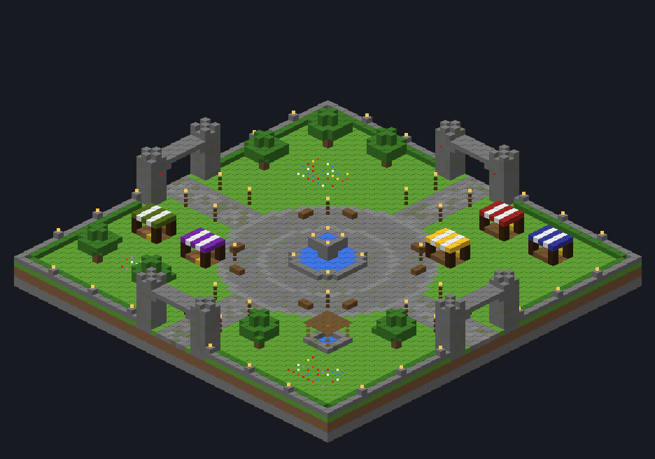

# minecraft-faction

Kit d'installation d'un serveur **Minecraft PvP Faction**, inspiré de LifeCraft, pour jouer entre potes sur un cluster Proxmox.

- **Serveur** : Paper 26.2 (supportée par FactionsUUID 4.7+ et OldCombatMechanics 2.6.0+)
- **Combat** : PvP 1.8 (pas de cooldown d'attaque, blocage à l'épée, etc.) grâce à OldCombatMechanics
- **Clients acceptés** : de la 1.8 à la dernière version, via ViaVersion, ViaBackwards et ViaRewind
- **Accès** : whitelist activée, seuls les joueurs ajoutés peuvent se connecter

## Plugins installés

| Plugin | Rôle |
|---|---|
| FactionsUUID | Factions, claims, power, raids |
| OldCombatMechanics | Mécaniques de combat 1.8 |
| ViaVersion / ViaBackwards / ViaRewind | Connexion depuis toutes les versions, de la 1.8 à la dernière |
| EssentialsX (+ Spawn, Chat) | /home, /tpa, /spawn, kits, économie |
| LuckPerms | Grades et permissions |
| Vault | Lien entre l'économie et les permissions |

`install.sh` récupère **la dernière version de chaque plugin au moment où il tourne** : via Modrinth, Hangar ou GitHub Releases selon le plugin. Les checksums sont vérifiés quand la source les fournit. Si un plugin est introuvable, le script le signale à la fin sans s'interrompre.

### FactionsUUID : téléchargement manuel

FactionsUUID n'est publié que sur SpigotMC, qui bloque les téléchargements automatiques. Il faut donc le récupérer une fois à la main :

1. Sur ton PC, récupère le jar sur https://www.spigotmc.org/resources/factionsuuid.1035/ (plugin payant depuis la 4.x ; le code reste open source sous GPLv3 sur https://github.com/drtshock/Factions si tu préfères le compiler toi-même).
2. Envoie-le dans le conteneur sous le nom `FactionsUUID.jar`, par exemple depuis l'hôte Proxmox :
   ```bash
   pct push 200 FactionsUUID-x.y.z.jar /opt/minecraft/plugins/FactionsUUID.jar
   ```
3. Dans le conteneur :
   ```bash
   chown minecraft:minecraft /opt/minecraft/plugins/FactionsUUID.jar
   systemctl restart minecraft
   ```

Les relances suivantes de `install.sh` conservent ce jar ; pour le mettre à jour, remplace-le de la même façon.

## Prérequis

- Une VM ou un conteneur LXC **Debian 12 ou 13** sur Proxmox
- **4 à 6 Go de RAM** pour le serveur (prévois 1 Go de plus pour le système)
- 2 à 4 vCPU : Minecraft profite surtout d'une **fréquence élevée**, plus que d'un grand nombre de cœurs
- 20 Go de disque minimum (le monde et les sauvegardes grossissent avec le temps)
- Un accès Internet sortant

> **LXC ou VM ?** Un conteneur LXC non privilégié suffit et consomme moins. Choisis une VM si tu préfères isoler complètement le serveur.

## Installation

Dans la VM ou le conteneur, en root :

```bash
apt update && apt install -y git
git clone https://github.com/PolishMen25/minecraft-faction.git
cd minecraft-faction
./install.sh
```

Tu peux changer les réglages en les passant devant la commande :

```bash
RAM=6G MC_VERSION=26.2 ./install.sh
```

| Variable | Défaut | Rôle |
|---|---|---|
| `MC_VERSION` | `26.2` | Version de Paper / Minecraft. Ne la monte que quand tous les plugins supportent la nouvelle version |
| `RAM` | `5G` | Mémoire allouée à Java |
| `JAVA_VERSION` | `25` | Version de Java (Temurin) |
| `MC_DIR` | `/opt/minecraft` | Dossier du serveur |
| `EULA` | *(question)* | Mets `true` pour accepter l'EULA Mojang sans qu'on te la demande |

Le script :
1. installe Java (Temurin) et les outils nécessaires ;
2. crée l'utilisateur système `minecraft` et le dossier `/opt/minecraft` ;
3. télécharge le dernier build stable de Paper et vérifie son checksum ;
4. télécharge les plugins ;
5. installe la configuration de départ (`server.properties`) ;
6. crée le service systemd `minecraft` (démarrage automatique) et une sauvegarde quotidienne à 5 h ;
7. démarre le serveur.

**Pour tout mettre à jour plus tard**, relance `./install.sh`. Il remplace Paper et les plugins par leurs dernières versions, mais **ne touche jamais à tes configs ni à ton monde**.

## Premier démarrage

Le premier lancement génère le monde, ce qui prend 1 à 3 minutes. Suis-le avec :

```bash
tail -f /opt/minecraft/logs/latest.log
```

Quand `Done (xx.xxxs)! For help, type "help"` apparaît, ajoute-toi à la whitelist et donne-toi les droits d'admin :

```bash
mc-cmd "whitelist add TonPseudo"
mc-cmd "op TonPseudo"
```

Puis connecte-toi avec l'adresse IP de la VM, sur le port `25565`.

> 📋 **Envoie-moi ce log de premier démarrage** : il permet de vérifier que tous les plugins se chargent bien.

## Administration au quotidien

| Action | Commande |
|---|---|
| Ouvrir la console | `mc-console` (pour en sortir sans arrêter le serveur : **Ctrl+B** puis **D**) |
| Envoyer une commande | `mc-cmd "commande"` |
| Ajouter un pote | `mc-cmd "whitelist add Pseudo"` |
| Démarrer / arrêter / redémarrer | `systemctl start|stop|restart minecraft` |
| État du service | `systemctl status minecraft` |
| Lire les logs | `tail -f /opt/minecraft/logs/latest.log` |
| Faire une sauvegarde | `mc-backup` |

## Sauvegardes

Le timer `minecraft-backup.timer` lance une sauvegarde **tous les jours à 5 h**. Les archives vont dans `/opt/minecraft/backups/` et seules les **7 dernières** sont gardées. Pendant la sauvegarde, l'écriture du monde est mise en pause pour que l'archive reste cohérente.

Pour restaurer une archive :

```bash
systemctl stop minecraft
cd /opt/minecraft
tar --zstd -xf backups/backup_AAAA-MM-JJ_HH-MM.tar.zst
chown -R minecraft:minecraft /opt/minecraft
systemctl start minecraft
```

> En complément, une sauvegarde Proxmox de la VM ou du conteneur (vzdump vers un PBS ou un autre stockage) te protège si le disque lâche.

## Jouer depuis l'extérieur

Pour que tes potes se connectent depuis chez eux, tu as deux options :
- **redirection de port** : redirige le port TCP `25565` de ta box vers l'IP de la VM ;
- **VPN** (Tailscale, WireGuard…) : plus sûr, car rien n'est exposé sur Internet, mais chaque joueur doit l'installer.

La whitelist reste ta protection principale : ne la désactive pas si le port est ouvert.

## Spawn médiéval

Le dossier `spawn/` contient un spawn médiéval de 64 × 64 blocs, généré par `spawn/generate_spawn.py` : fontaine à deux niveaux, place pavée, quatre arches crénelées avec bannières, lampadaires, bancs, muret et haie, jardins fleuris, puits et étals de marché.



**Installation**
1. Fais une sauvegarde : `mc-backup`.
2. Dans le conteneur : `cd ~/minecraft-faction && git pull && ./spawn/install-spawn.sh`
3. En jeu, choisis un terrain plutôt plat et place-toi au centre, les pieds sur le sol, puis :
   ```
   /place template lifecraft:spawn_medieval ~-32 ~-5 ~-32
   ```
   Le spawn est centré sur toi, son sol remplace le niveau du terrain et tout ce qui dépasse dans le volume de 64 × 64 × 19 au-dessus est dégagé.
4. Monte sur la fontaine (au centre exact) et protège la zone : `/f warzone 6` puis `/f safezone 2`.
5. Va sur la place, devant la fontaine, et définis le point d'apparition : `/setworldspawn` puis `/setspawn`.

Pour modifier le spawn, édite `generate_spawn.py` puis relance `python3 spawn/generate_spawn.py` (Pillow requis pour l'aperçu).

## Grades (LuckPerms)

`scripts/setup-grades.sh` crée quatre grades hiérarchiques, chacun héritant du précédent, avec préfixe dans le chat :

| Grade | Préfixe | Permissions principales |
|---|---|---|
| Joueur (`default`) | `[Joueur]` | /spawn, /home, /sethome, /tpa, /msg, /warp, /kit, /pay, /bal |
| VIP | `[VIP]` | + plusieurs homes, /craft, /ec, /hat, /nick, couleurs dans le chat |
| Modo | `[Modo]` | + /kick, /mute, /ban, /tempban, /jail, /vanish, /invsee, /tp, /whitelist |
| Admin | `[Admin]` | toutes les permissions |

```bash
./scripts/setup-grades.sh xPolishMenx        # crée les grades et met ce joueur Admin
mc-cmd "lp user Pseudo parent set vip"       # donner un grade (default / vip / modo / admin)
```

## Mémoire

Au-delà de 12 Go (`RAM=16G ./install.sh`), le script applique automatiquement les réglages G1 recommandés pour les gros tas. Inutile de dépasser 16 Go : un serveur Minecraft n'en tire aucun bénéfice et les pauses du ramasse-miettes s'allongent. Le conteneur doit avoir environ 4 Go de plus que `RAM`.

## Performances : chargement des chunks

Trois leviers, du plus efficace au moins efficace :

1. **Pré-générer la carte avec Chunky** (installé par le script). Les chunks sont alors seulement lus sur le SSD au lieu d'être générés quand un joueur arrive. En console :
   ```
   worldborder center 0 0
   worldborder set 10000
   chunky radius 5000
   chunky start
   ```
   `chunky progress` affiche l'avancement. Fais pareil dans le Nether (`chunky world world_nether`, rayon plus petit).
2. **Donner beaucoup de RAM au conteneur, mais pas à Java** : la RAM du conteneur au-delà du tas Java sert de cache disque à Linux. Les fichiers de région déjà lus restent en mémoire, et les chunks se chargent depuis la RAM.
3. **Tous les cœurs CPU au conteneur** : Paper génère et charge les chunks sur plusieurs threads.

`region-file-compression=lz4` (dans `server.properties`) accélère aussi la lecture et l'écriture des chunks.

## Arborescence du dépôt

```
install.sh                 Script d'installation / mise à jour
config/server.properties   Configuration de départ du serveur
config/ops.json.example    Exemple de fichier d'opérateurs
scripts/mc-console         Ouvre la console (tmux)
scripts/mc-cmd             Envoie une commande au serveur
scripts/mc-backup          Sauvegarde avec rotation
```

## Prochaines étapes

- [ ] Vérifier le log du premier démarrage
- [ ] Régler les raids : explosions TNT et creepers dans les claims, vitesse de remontée de la power, protection du spawn
- [ ] Créer les grades LuckPerms (joueur, VIP, modo, admin)
- [ ] Plugins sur mesure façon LifeCraft : minerais, armures, events KOTH
